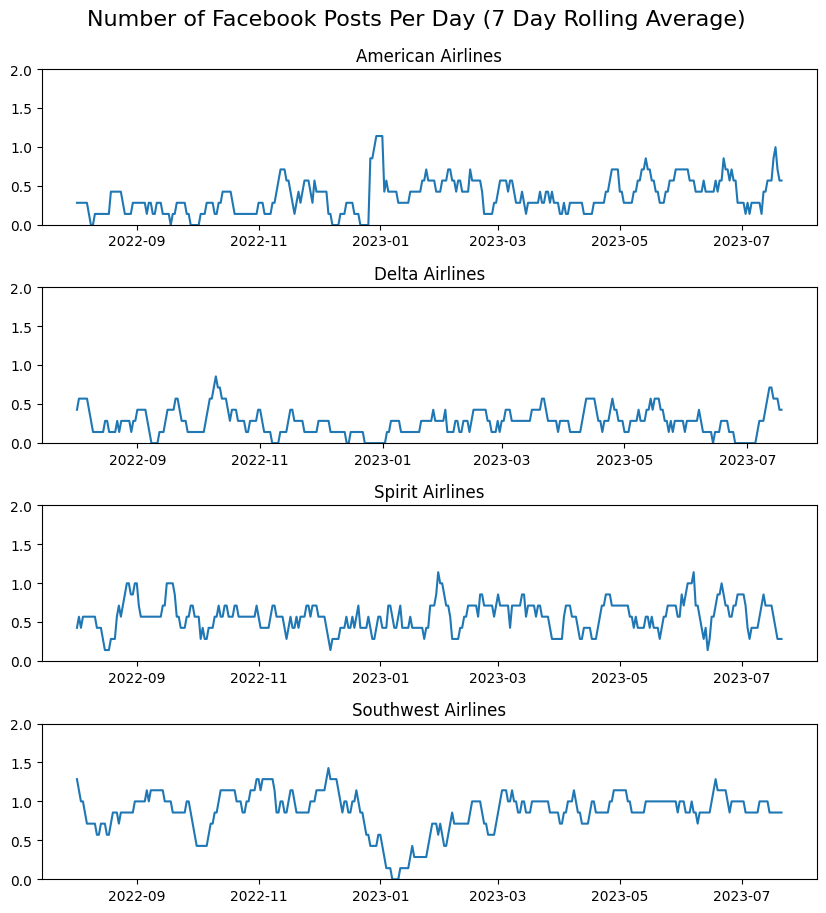
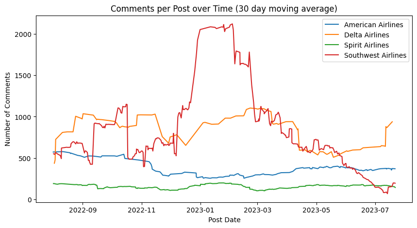
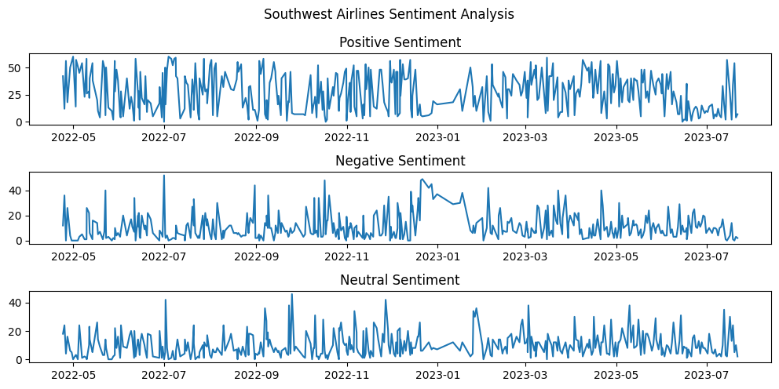

# Airline Sentiment Analysis

## About the Project
This project analyzes Facebook comments from the pages of four major US airlines: [Delta](https://www.facebook.com/delta/), [Southwest](https://www.facebook.com/SouthwestAir/), [Spirit](https://www.facebook.com/SpiritAirlines/), and [American Airlines](https://www.facebook.com/AmericanAirlines/).  We look at these airlines' post frequency, the number of comments per post, and the sentiment of these comments. To analyze comment sentiment, we use an [existing roBERTa model](https://huggingface.co/cardiffnlp/twitter-roberta-base-sentiment) finetuned on Twitter posts.  Interestingly, in this analysis, we can spot changes in user sentiment and airline posting behavior during disruptive events in the airline industry, like the [Southwest Airlines mass flight cancellations](https://en.wikipedia.org/wiki/2022_Southwest_Airlines_scheduling_crisis) of December 2022.

## Results

From this project, we can determine the number of posts per day, the number of comments per post, and the sentiment of a sample of the comments:

Interestingly, there is a dropoff in Southwest's posting frequency in December 2022.  At the same time, the comments per post increases sharply.  Further, when looking at sentiment data it appears negative sentiment spikes during this time.  I believe this highlights a negative consumer perception of Southwest due to flight cancellations during this time.

## Using this repository
First, install dependencies from the requirements.txt.  This can be done easily with pip:

`pip install -r requirements.txt`

## Project Structure
This project has a few notebooks and other python files used for data collection and analysis:
1) facebook-scraper.ipynb: scrapes facebook posts and comments from a given facebook page
2) sentiment-classifier.ipynb: analyzes the sentiment of comments on each post
3) data-analyzer.ipynb: breaks down collected data into charts.  For example number of posts per day, comments per post, number of positive/negative/neutral comments per post, etc.
4) roberta.py: contains a helper class for classifying sentiment with the roBERTa model via the huggingface transformers library

This repo also contains 2 data folders:
1) scraped_data: raw comments from airline facebook pages scraped with [facebook-scraper](https://github.com/kevinzg/facebook-scraper)
2) sentiment_data: processed data, containing the number of positive/negative/neutral comments on each post 